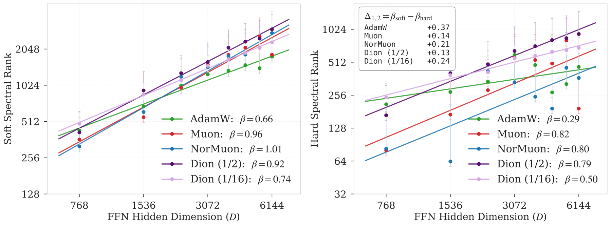

# Optimizer-Induced Spectral Scaling Laws

[](https://github.com/optimizer-scaling-laws/spectral-scaling-laws/actions/workflows/ci.yml)
[](https://arxiv.org/abs/2605.21803)
[](LICENSE)

Official code for paper **[Same Architecture, Different Capacity: Optimizer-Induced Spectral Scaling Laws](https://arxiv.org/abs/2605.21803)**.

<div align="center">
  <a href="https://arxiv.org/abs/2605.21803"> <b>Paper</b></a> &nbsp;|&nbsp;
  <a href="https://optimizer-scaling-laws.github.io/">🌐 <b>Project Page</b></a> &nbsp;|&nbsp;
  <a href="https://colab.research.google.com/github/optimizer-scaling-laws/spectral-scaling-laws/blob/main/notebooks/reproduce_main_figures.ipynb"> <b>Reproduce in Colab</b></a>
</div>

<br>

<p align="center">
  <br>
  <em><strong>Figure 1.</strong> Spectral scaling exponents depend on optimizer choice: soft (left) and hard (right) spectral rank as a function of FFN width in GPT-2 160M. AdamW exhibits the largest hard–soft asymmetry (Δ = β<sub>soft</sub> − β<sub>hard</sub> = 0.37), indicating concentrated eigenspectra. Muon and Dion (1/2) reduce this asymmetry to Δ ≈ 0.14. Moreover, hard-rank scaling exhibits stronger dependence on optimizer choice, compared to soft-rank scaling.</em>
</p>

## TL;DR --> Same architecture, different optimizer, different capacity

Realized representation capacity is not architecture-only — it emerges from the architecture–optimizer interaction. Holding the Transformer architecture and width schedule fixed, different optimizers turn added FFN width into usable capacity at different rates, changing the *scaling exponents* of the FFN representation spectrum. The separation is sharpest in **hard** spectral rank: globally, AdamW scales at **β ≈ 0.29** while Muon and NorMuon reach **β ≈ 0.80**, even though soft rank grows with width across all optimizers. On rare (TAIL) tokens the gap widens further — AdamW **β ≈ 0.44** vs. Muon **β ≈ 1.02**, a **2.3× larger exponent**. These optimizer-induced shifts **exceed** architectural interventions (attention rank, positional encoding), and **matched pretraining loss does not imply matched representation geometry**.

## Reproduce the headline result in 60 seconds

No GPU, no training, no raw logs. The Colab notebook refits the scaling exponents and regenerates the main figures directly from the committed processed CSVs:

[](https://colab.research.google.com/github/optimizer-scaling-laws/spectral-scaling-laws/blob/main/notebooks/reproduce_main_figures.ipynb)

To regenerate every committed PDF figure locally:

```bash
pip install -e ".[metrics,analysis]"
make figures      # writes all figures to results/figures/
```

## Installation

`pyproject.toml` is the single source of truth for dependencies — install only the extras you need:

| Extra | Command | For |
|---|---|---|
| `metrics` | `pip install -e ".[metrics]"` | CPU spectral diagnostics (NumPy + PyTorch) |
| `analysis` | `pip install -e ".[analysis]"` | figure scripts and the Colab notebook path |
| `train` | `pip install -e ".[train]"` | training stack (configs, WandB, HF cache, Triton) |
| `dev` | `pip install -e ".[dev]"` | tests, linting, and release checks |
| `metrics,analysis` | `pip install -e ".[metrics,analysis]"` | figure reproduction without training deps |

## Run the diagnostic on your own model

The spectral-rank metrics are not tied to this training stack — point them at any model's FFN activations to measure the spectral capacity *your* optimizer is realizing:

```python
from optimizer_ssl.probe import spectral_rank

metrics = spectral_rank(activations)          # soft rank, hard rank, spectral entropy
# pass token_freq=... to split HEAD / MID / TAIL
```

See [`docs/diagnostic_api.md`](docs/diagnostic_api.md) and runnable CPU examples in [`examples/`](examples/).

## What's in here

```text
optimizer_ssl/            training stack, spectral telemetry, scaling fits, and the standalone diagnostic
  ├── spectra/            covariance spectra, soft/hard rank, frequency-bucketed (HEAD/MID/TAIL) metrics
  ├── analysis/           log parsing, rank aggregation, power-law fits with confidence intervals
  └── probe.py            model-agnostic spectral-rank diagnostic
configs/                  full launch-config grids for every paper experiment (+ reusable components)
scripts/
  ├── train/              single-run and sweep launchers
  ├── analysis/           raw-log → normalized CSV → rank-scaling beta tables
  ├── reproduce/          one-command figure reproduction wrappers
  └── preprocess/         FineWeb10B download and token-frequency preprocessing
results/
  ├── processed/          lightweight released CSVs + token_frequencies.npy
  ├── figures/            publication-quality PDF figures
  └── figure_manifest.csv per-figure provenance: inputs, command, raw-log coverage
notebooks/                Colab-ready headline reproduction
third_party/dion/         vendored Dion / Muon / NorMuon implementations (upstream notices preserved)
docs/                     data, metrics, reproduction, training, compute, and optimizer notes
tests/                    CPU-safe sanity tests (metrics, fits, parsing, configs, artifacts)
```

## Reproduce the figures

All figure families ship with their processed CSVs, so every committed PDF regenerates without training:

```bash
make figures
# equivalently:
bash scripts/reproduce/reproduce_main_results_from_processed.sh results/processed results/figures
```

To rebuild the 160M processed CSVs from external raw logs, fill in a run manifest based on `results/processed/run_metadata_template.csv`, then:

```bash
bash scripts/reproduce/reproduce_main_results_from_logs.sh \
  results/processed/run_metadata.csv \
  results/processed
```

The raw-log path normalizes the paper-run telemetry schema (`SE_post`, `PR_post`) into the public vocabulary (`soft_rank`, `hard_rank`, `spectral_entropy`). Every figure maps to its inputs, exact command, and raw-log coverage status in [`results/figure_manifest.csv`](results/figure_manifest.csv); see [`docs/reproduction.md`](docs/reproduction.md) for the reproduction tiers and release boundary.

## Train from scratch

Released configs cover every experiment family. Per-optimizer hyperparameters are summarized in [`docs/optimizers.md`](docs/optimizers.md) and encoded in [`configs/components/optimizers/`](configs/components/optimizers/); the configs themselves live under `configs/paper_runs/<family>/`, and full grid details (model dims, steps, token budget) are in [`docs/compute_budget.md`](docs/compute_budget.md). Every launcher lives in [`scripts/train/`](scripts/train/) and runs as `CUDA_VISIBLE_DEVICES=… bash scripts/train/<script> [optimizer]`.

| Family | Scale | Optimizers | Widths | GPUs | Launch |
|---|:--:|---|:--:|:--:|---|
| Main width sweep | 160M | AdamW · Muon · NorMuon · Dion(1/2) · Dion(1/16) | 1×–8× | 4 | `run_width_sweep_160m.sh [opt]` |
| Main width sweep | 350M | AdamW · Muon · NorMuon · Dion(1/16) | 1×–4× | 8 | `run_width_sweep_350m.sh [opt]` |
| Dion rank sweep | 160M | AdamW · Dion(1/2 · 1/4 · 1/8 · 1/16) | 1×–8× | 4 | `run_dion_rank_sweep_160m.sh` |
| Matched-loss | 160M | AdamW(6K · 12K) · Dion(1/16) | 1×–8× | 4 | `run_matched_loss_160m.sh` |
| Architecture × optimizer | 160M | 5 optimizers × {12-head · 6-head} | 1×–8× | 4 | `run_architecture_vs_optimizer_160m.sh` |

For example, the AdamW arm of the 160M sweep on four GPUs:

```bash
CUDA_VISIBLE_DEVICES=0,1,2,3 bash scripts/train/run_width_sweep_160m.sh adamw
```

Logs and eigen metrics are written under `outputs/` (git-ignored); the figures themselves reproduce CPU-only in seconds.

## Data and token-frequency buckets

The raw FineWeb10B shards are not committed. To download the pretokenized cache and recompute the released frequency table:

```bash
bash scripts/preprocess/prepare_fineweb10b_token_buckets.sh
# smoke test on two shards:
NUM_TRAIN_SHARDS=2 bash scripts/preprocess/prepare_fineweb10b_token_buckets.sh
```

You don't need the raw shards to assign HEAD/MID/TAIL buckets — the released `results/processed/token_frequencies.npy` is sufficient on its own:

```text
results/processed/token_frequencies.npy
results/processed/token_frequency_stats.json
```

## Reproducibility notes

Released configs include `seed: 1337` and an explicit `spectral_error_policy`. The paper used one run per configuration rather than multi-seed sweeps; reported scaling exponents include confidence intervals from the log–log fits, and the seed field can be varied for multi-seed reproductions when compute permits. See [`docs/reproduction.md`](docs/reproduction.md).

## Acknowledgments

The GPT training stack and data loader derive from [modded-nanoGPT](https://github.com/KellerJordan/modded-nanogpt); the Muon, NorMuon, and [Dion](https://github.com/microsoft/dion/) optimizers are vendored under [`third_party/dion/`](third_party/dion/) with their upstream READMEs and notices preserved. These optimizers are prior work used as-is, not contributions of this repository. See [`NOTICE.md`](NOTICE.md).

## Citation

If you use this code or its findings, please cite this paper:

```bibtex
@article{jha2026optimizer,
  title   = {Same Architecture, Different Capacity: Optimizer-Induced Spectral Scaling Laws},
  author  = {Nandan Kumar Jha and Brandon Reagen},
  year    = {2026},
  url     = {https://arxiv.org/abs/2605.21803}
}
```

The spectral scaling-laws framework was introduced in our earlier work (EMNLP 2025), which you may also wish to cite:

```bibtex
@inproceedings{jha2025spectral,
  title     = {Spectral Scaling Laws in Language Models: How Effectively Do Feed-Forward Networks Use Their Latent Space?},
  author    = {Jha, Nandan Kumar and Reagen, Brandon},
  booktitle = {Proceedings of the 2025 Conference on Empirical Methods in Natural Language Processing (EMNLP)},
  year      = {2025}
}
```
